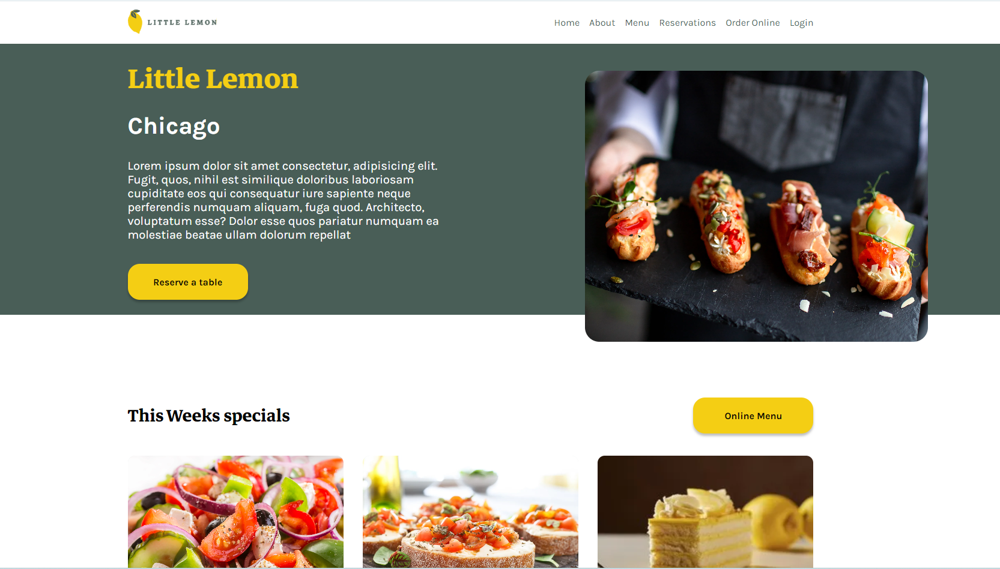

# Little Lemon Restaurant - Proyecto de Graduación

Este proyecto de graduación es un sitio web desarrollado utilizando React, que permite a los usuarios ver el menú del restaurante Little Lemon y realizar reservas en línea.

## Instalación

1. Clona este repositorio en tu máquina local.
2. Abre una terminal y navega hasta la carpeta del proyecto.
3. Ejecuta `npm install` para instalar las dependencias del proyecto.
4. Ejecuta `npm start` para iniciar la aplicación en modo de desarrollo.

## Capturas de Pantalla

A continuación se muestran algunas capturas de pantalla del sitio:

## Funcionalidades

- Visualización del menú del restaurante Little Lemon.
- Realización de reservas en línea.

## Tecnologías Utilizadas

- React
- HTML
- CSS
- JavaScript

## Contribuyendo

Si deseas contribuir a este proyecto, ¡te invitamos a hacerlo! Por favor, abre un issue o envía un pull request.

## Autores

- [Germani Benitez]

## Licencia

Este proyecto está bajo la Licencia MIT. Consulta el archivo [LICENSE](LICENSE) para obtener más detalles.
